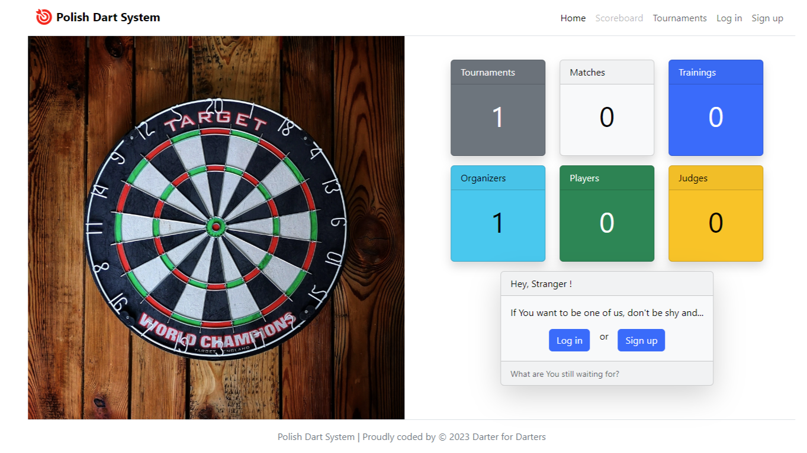
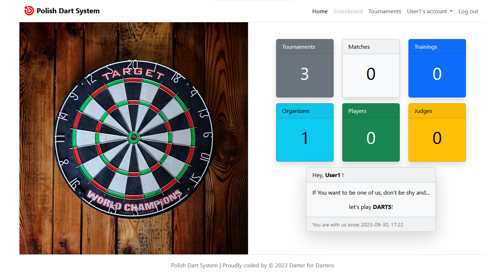
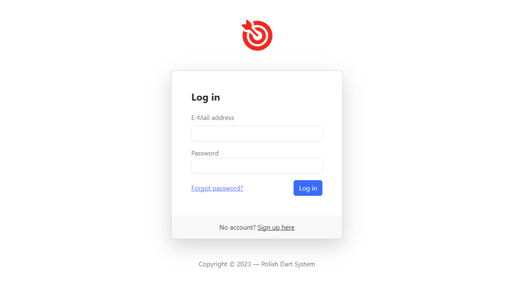
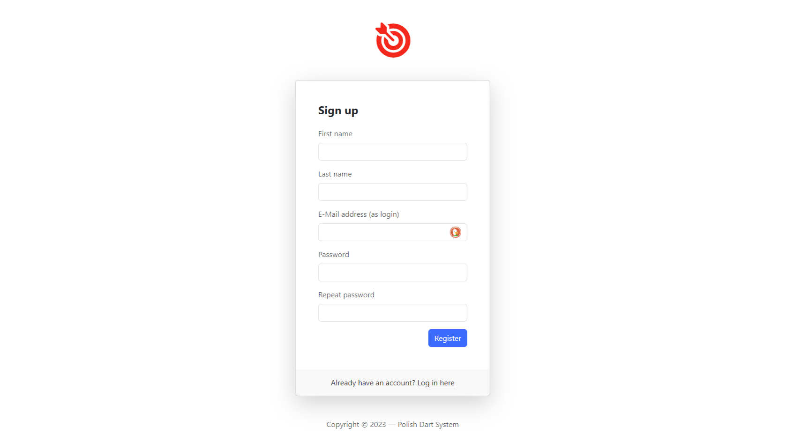
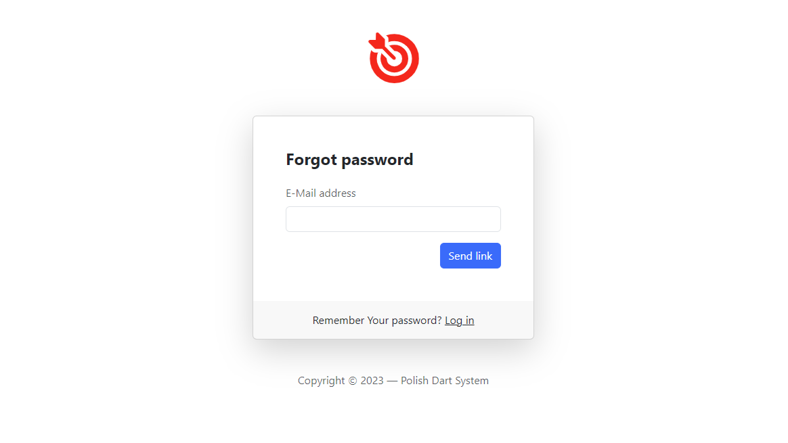
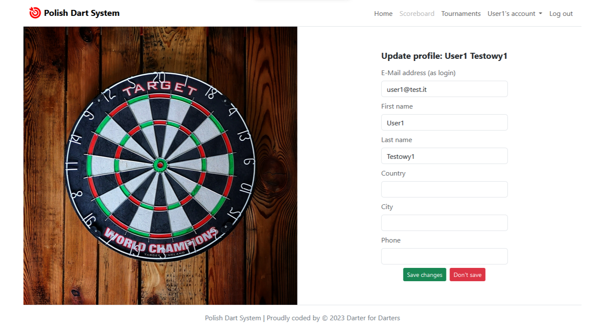
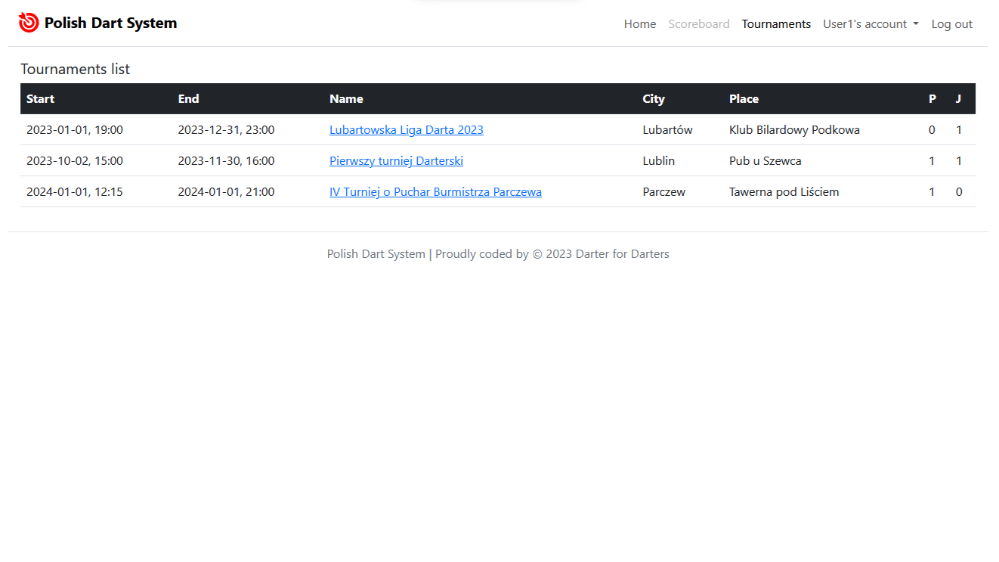
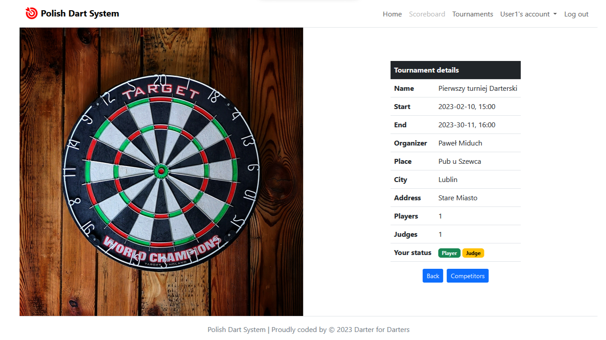
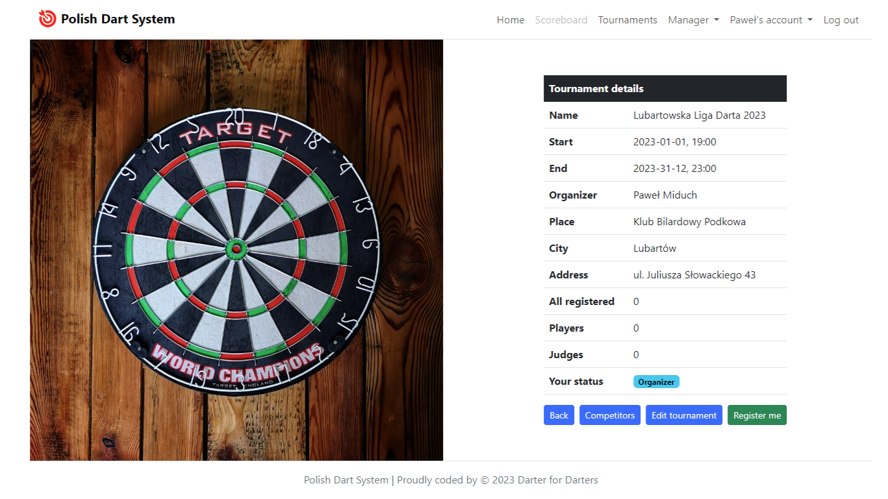
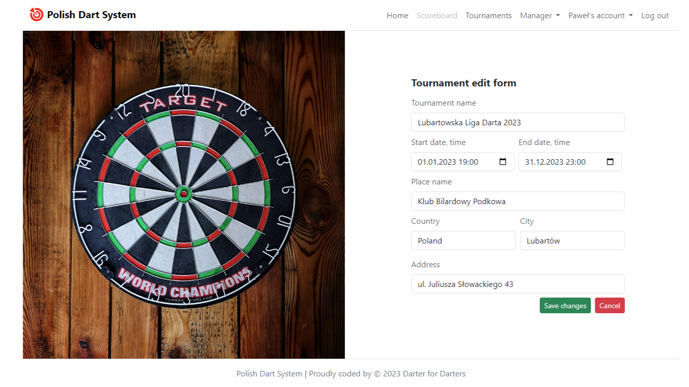

# Polish Dart System
> It's my first extensive `Django` project, which will help me to known some new technologies like `Docker`
> and DevOps tools for continuous integration and continuous delivery (CI/CD).
>
> Since the application is still in the development process, it is impossible to update the `README.md` frequently. 
> Once some modules are refined, its more detailed description of how it works and screenshots will appear.

## Table of Contents
* [Idea](#idea)
* [Goals](#goals)
* [Technologies](#technologies)
* [Features](#features)
* [Demo](#demo)
* [Screenshots](#screenshots)

# Idea
The idea to create an application was born during a darts competition in one of the local pubs, 
during which the results were written down on pieces of paper.

# Goals

### The main tasks of the application are currently:
* collecting information about ongoing darts tournaments in one place, along with the possibility of signing up
for players' lists
* automation of the registration and approval process of tournament participants
* automation of the selection of pairs of players
* keep games schedules
* displaying individual game results and statistics

### in the future it is planned:
* adding a `scoreboard` module that will help collect and convert points entered during the game to ultimately 
generate statistics for a given game and the entire tournament
* rescaling the application to support more tournaments and users
* deploying and maintaining at VPS with own domain

# Technologies:

### So far used:
- [Python](https://www.python.org/) - version 3.12
- [Django](https://www.djangoproject.com/) framework - version 5.0.3
- [SQLite](https://www.sqlite.org/) - version 3.45.2
- [HTML](https://en.wikipedia.org/wiki/HTML) - version 5
- [CSS](https://en.wikipedia.org/wiki/CSS) - version 3
- [Bootstrap](https://getbootstrap.com/) - version 5.3.0
- [Docker](https://www.docker.com/)
- and [GitHub](https://github.com) of course

### Soon:
- deploying on Virtual Personal Server with OS like Linux Ubuntu Server and own domain
- [Nginx](https://nginx.org)
- CI/CD

# Features

### User not logged in
As a user who is not logged in, you can only see the basic information about planned and completed tournaments, 
such as date, name, city, place and the number of players approved by the organizer.

>Such a not logged in user can, of course, create an account to have more options.

### User logged in
__User__ - i.e. one who does not have the `organizer` status, but has the ability to:
* see own profile (data that is saved in the database)
* change or add the data provided during registration
* simple registration for the tournament by clicking `Register me` button
* see own registration status in tournament details (`registered`, `player`, `judge`)
* see a list of approved players for a given tournament and their statuses
* after approval by the `organizer` and granting him the status of a `player` or `judge`, he may perform these functions 
in the tournament for which he registered
* reset own password
* become an `organizer`

__Organizer__ - i.e. one who has the `organizer` status assigned by the administrator:
* has possibilities like `user` (except the last one of course)
* additionally he can:
    * add information about tournaments he organizes
    * edit information about tournaments he have added
    * grant and revoke `player` and/or `judge` status to registered participants in their tournaments
    * create a schedule of matches for approved players and assign judges to them
    * enter match results
  

# Demo

To check how this app works on-line, please feel free to go to 
[pamid.pythonanywhere.com](https://pamid.pythonanywhere.com/)

# Screenshots

### Main page for not log in user

### Main page for log in user

### Log in page

### Sign up page

### Password reset page

### Update user profile form

### Tournaments list for log in user

### Tournament detail for log in user (approved by organizer as `player` and `judge`)

### Tournament detail for log in organizer

### Tournament edit form for log in organizer

